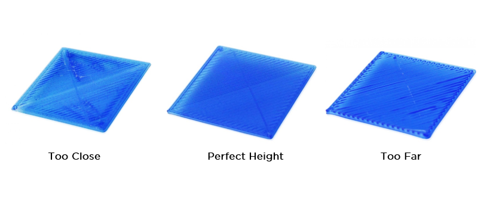
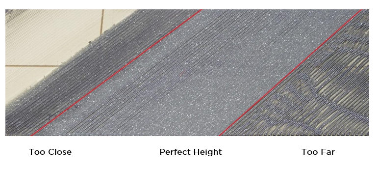

<!--
 Copyright (c) 2022 Chris Laprade (chris@rootiest.com)
 
 This software is released under the MIT License.
 https://opensource.org/licenses/MIT
-->
# Probe Offsets

## References

[Klipper Config Reference](https://www.klipper3d.org/Config_Reference.html#bltouch)

[BL-Touch](https://www.klipper3d.org/BLTouch.html)

## Sample Config

### (Ender 3/etc) Creality 4.2.2 or 4.2.7:

The following is a typical config for a CRTouch:

    [bltouch] 
    sensor_pin: ^PB1
    control_pin: PB0
    x_offset: 0                  # Change to fit your printer
    y_offset: 0                  # Change to fit your printer
    z_offset: 2.295              # Change to fit your printer
    probe_with_touch_mode: True
    stow_on_each_sample: False   # Keep the probe extended between points
    samples: 2                   # Probe each point at least twice
    samples_tolerance: 0.0125    # If those measurements aren't this close then
    samples_tolerance_retries: 5 # Re-probe this many times and use the average

You may find that your bl-touch requires slightly different configurations. There are many different variations and clones of the original bl-touch design.

This is explained in detail [here in the docs](https://www.klipper3d.org/BLTouch.html#bl-touch-clones).

Note that the `samples_tolerance` used in the above example is quite low so it frequently will probe a point several times and use the average. 

You can change the samples and tolerance settings to fit your needs. These settings are explained in more detail in the docs [here](https://www.klipper3d.org/Config_Reference.html#probe) and [here](https://www.klipper3d.org/Config_Reference.html#bltouch).

You ***will*** need to change the x and y offsets to be accurate for your probe's position relative to the nozzle. Follow [the directions in the docs](https://www.klipper3d.org/Probe_Calibrate.html) to measure those values. 

Then you will also need to calibrate the z-offset. (Again, follow [the docs](https://www.klipper3d.org/Probe_Calibrate.html#calibrating-probe-z-offset))

## Calibrating the probe offsets

### X,Y offsets walkthrough:

The basic idea is to compare the coordinates the printer registers for the nozzle and coordinates registered for the probe in the same physical location on the bed. The offset is the difference between those two sets of coordinates.

Run the `PROBE` command. Mark the point on the bed where the probe pin touched using whatever method works for you.

You can use tape, your memory, a sharpie, it doesn't matter. Whatever works.

Run `GET_POSITION` and write down the coordinates as "probe coordinates".

Use the mainsail/fluidd interface to manually move the ***NOZZLE*** as close as you possibly can to that point you marked where the **probe pin** touched.

Run `GET_POSITION` again and note the new coordinates as "nozzle coordinates".

Then:

The probe `x_offset` is the X "nozzle coordinates" minus the X "probe coordinates"(This is typically a negative number if your probe is on the left of the nozzle)

The probe `y_offset` is the Y "nozzle coordinates" minus the Y "probe coordinates"

Put those values in your config and restart. 

Done!

### Z offset walkthrough:

Klipper has a built-in function for finding the z-offset. 

This is covered [in the docs here](https://www.klipper3d.org/Probe_Calibrate.html#calibrating-probe-z-offset).

It's also [described in more detail here](https://www.klipper3d.org/Bed_Level.html#the-paper-test).

Run `PROBE_CALIBRATE`

Then use `TESTZ Z=-1` to bring the nozzle 1mm **closer** to the bed

Use `TESTZ Z=+1` to bring the nozzle 1mm **further** from the bed

And of course you can do `TESTZ Z=-0.001` to go 0.001mm closer, etc

Using these commands, adjust your nozzle height until you are about 100 microns from the (cold) bed. This is roughly the thickness of a sheet of paper, and the Klipper docs suggest it's also the approximate expected thermal expansion when the bed is heated.

When you are happy with it (0 is actually 0) run `ACCEPT` followed by `SAVE_CONFIG`

Some notes:

The `+` or `-` are necessary in the `TESTZ` commands! If you do `TESTZ Z=1` it will move the nozzle to what it currently thinks 1mm from the bed is. We use the `TESTZ Z=+1` and `TESTZ Z=-1` to move it +1 or -1 from the **current** position.

Typically this is combined with "the paper test" where you use a sheet of paper (a standard printer paper is about 0.1mm thick) When you feel resistance from the nozzle pressing against the paper, that means you are about 0.1mm away from the bed. This way you don't have to actually contact the bed with the nozzle to do this calibration. (We need the exact 0 height, but obviously we never print that close to the bed or no filament would come out)

When you run `TESTZ Z=-0.001` and other very small values then nozzle will life a little before lowering in a kind of bouncing motion. This often looks like it's hit a soft limit and not lowering, but it actually ***is*** still lowering. Klipper does this to get more precise movements and hopefully do less damage if it *does* hit the bed. The little bounce is normal, and it's still working! (You'll understand when you see it)

### Refining Z-offset

I recommend to set your Z offset as best you can using the above methods, and then print [a large 1-layer square](https://www.printables.com/model/9838-first-layer-test-60x60-mm-square-z-calibration).

Use that print to further refine your z-offset.

Here are some images to help you recognize a properly calibrated first layer:

(These images were shamelessly borrowed from [this site](https://core-electronics.com.au/guides/ultimaker-printer-platform-calibrate/))